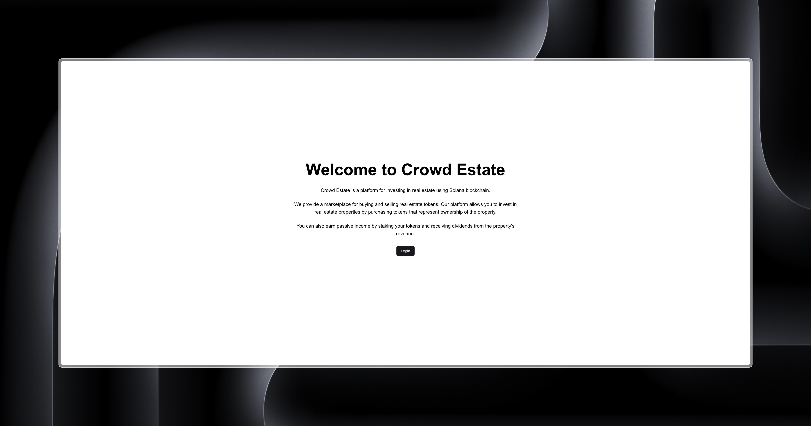
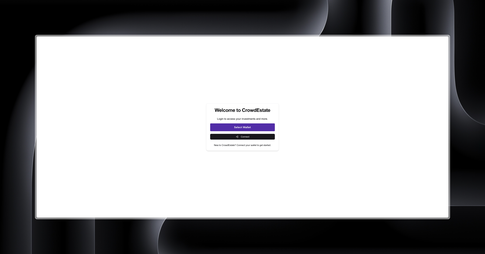

# LandFY

LandFY is a blockchain-based crowdfunding platform for real estate projects, built on Solana using Anchor. The platform allows users to invest in fractional property ownership, track their investments, and participate in governance through proposals and voting.

## Features

-   **Fractional Property Ownership**: Tokenized real estate properties, allowing users to invest in fractions of a property.
-   **Property Investment**: Users can invest in properties using USDC and receive tokens representing their ownership.
-   **Dividend Distribution**: Investors can claim dividends based on their property ownership.
-   **Governance**: Investors can create and vote on proposals, such as minting additional tokens or changing the property administrator.
-   **Secure Withdrawals**: Investors can withdraw their investments, returning their tokens and receiving USDC.
-   **Property Closure**: Administrators can close properties after all tokens are burned or withdrawn.

## Technologies Used

-   **Blockchain**: Solana, Anchor
-   **Backend**: Node.js, TypeScript, Express.js
-   **Database**: Supabase
-   **Cache**: Redis
-   **Frontend**: Next.js, React, Tailwind CSS
-   **Others**: Axios, React Context, Solana Wallet Adapter

## Checklist: LandFY - Real Estate RWA Crowdfunding Platform

### **Essentials**

#### **Blockchain (Solana & Anchor)**

-   [x] Implement smart contracts for:
    -   [x] Tokenization of real estate properties
    -   [x] Handling and tracking investments
-   [x] Implement efficient state management using Solana's account model
-   [x] Use Program Derived Addresses (PDAs) appropriately for account management

#### **Backend (Node.js & TypeScript)**

-   [x] Develop API endpoints for:
    -   [x] User management (registration, login, profile updates)
    -   [x] Property CRUD operations (create, read, update, delete properties)
    -   [x] Investment tracking and management
    -   [x] Fetching all users with their investments
-   [x] Implement robust error handling and logging
-   [x] Ensure proper data validation and sanitization
-   [x] Integrate API with Solana blockchain for transaction processing

#### **Database (Supabase)**

-   [x] Design an efficient schema for storing:
    -   [x] User profiles
    -   [x] Property details (e.g., property name, price, tokens available)
    -   [x] Investment records (tracking user investments)

#### **Frontend (Next.js + Tailwind CSS)**

-   [x] Create a responsive and intuitive user interface
-   [x] Implement the following pages/components:
    -   [x] **Home Page** with featured properties
    -   [x] **Property Listing Page** displaying all properties
    -   [x] **Property Detail Page** with investment options
    -   [x] **User Dashboard** to track investments and returns
-   [x] Implement proper state management using React Context

---

### **Bonus Features**

#### **Blockchain**

-   [x] Implement smart contracts for:
    -   [x] Dividend distribution
    -   [x] Governance and voting system
-   [x] Ensure proper access control and security measures in smart contracts

#### **Backend**

-   [ ] Develop API endpoints for:
    -   [ ] Creation and voting of governance proposals
-   [x] Implement caching mechanisms to improve performance

#### **Database**

-   [x] Design schema for storing governance proposals and votes
-   [x] Implement proper indexing to optimize query performance
-   [ ] Utilize Supabase's real-time features for live updates where appropriate

#### **Frontend**

-   [x] Property listing page with search and filter functionality
-   [ ] Governance page for viewing and voting on proposals
-   [x] Admin panel for property and user management
    -   [x] Implement UI for managing users and properties

---

### **Additional Features**

-   [ ] Implement a secondary market for trading property tokens
-   [ ] Add real-time notifications for investment updates and governance activities
-   [ ] Integrate with external APIs for property valuation data
-   [ ] Implement multi-language support for a global audience
-   [ ] Add comprehensive analytics and reporting features

---

### **Evaluation Criteria**

#### **Blockchain Implementation**

-   [x] Correct implementation of smart contracts using Solana and Anchor
-   [x] Efficient use of Solana's features, including PDAs and account management
-   [x] Security considerations and access control in smart contract development

---

## Installation

### **Prerequisites**

-   [Node.js](https://nodejs.org/)
-   [Yarn](https://yarnpkg.com/)
-   [Rust](https://www.rust-lang.org/)
-   [Solana CLI](https://docs.solana.com/cli/install-solana-cli-tools)
-   [Anchor](https://www.anchor-lang.com/docs/installation)

### **Clone the Repository**

```bash
git clone https://github.com/marcelofeitoza/landfy.git
cd landfy
```

### **Configure Environment Variables**

#### **Backend**

Create a `.env` file inside the `app/server/` directory and add the following variables:

```env
SUPABASE_URL=<your_supabase_url>
SUPABASE_KEY=<your_supabase_jwt_key>
PORT=5500
ADM=<keypair_bytes>
REDIS_URL=redis://redis:6379
```

**Variable Descriptions:**

-   `SUPABASE_URL`: URL of your Supabase instance.
-   `SUPABASE_KEY`: JWT key for accessing Supabase.
-   `PORT`: Port on which the backend server will run.
-   `ADM`: Array of bytes representing the administrative keypair.
-   `REDIS_URL`: Connection URL for Redis (set to `redis://redis:6379` for Docker, or `localhost:6379` if running Redis locally).

#### **Frontend**

Create a `.env.local` file inside the `app/client/` directory and add the following variables:

```env
NEXT_PUBLIC_ADM="<keypair_bytes>"
NEXT_PUBLIC_API_URL="http://localhost:5500"
```

**Variable Descriptions:**

-   `NEXT_PUBLIC_ADM`: Administrative keypair used in the frontend.
-   `NEXT_PUBLIC_API_URL`: URL of the backend API (set to `http://localhost:5500` for local development).

**Note:** Ensure that `.env` and `.env.local` files are listed in `.gitignore` to prevent sensitive information from being committed to version control.

### **Install Dependencies**

#### **Backend**

```bash
cd app/server
yarn install
```

#### **Frontend**

```bash
cd app/client
yarn install
```

### **Build the Program**

From the root of the project, execute:

```bash
anchor build
```

### **Test the Program**

From the root of the project, execute:

```bash
anchor test
```

### **Deploy the Program**

To deploy the program to a Solana cluster (e.g., Devnet), execute:

```bash
anchor deploy --provider.cluster devnet # Ensure you have enough SOL to pay for the deployment
```

### **Start the Backend Server**

```bash
cd app/server
yarn start # Make sure Supabase is set up and Redis is running- with Docker or locally
```

### **Start the Frontend Server**

```bash
cd app/client
yarn start
```

## Running with Docker

To simplify running the application, you can use Docker. Follow the steps below:

### **Build and Run Containers**

From the root of the project, execute:

```bash
cd app/server
docker compose up --build -d
```

### **Verify the Containers**

To check if the services are running correctly, execute:

```bash
docker compose ps
```

## Configuration

### **Environment Variables**

#### **Backend (`app/server/.env`)**

-   **SUPABASE_URL**: URL of your Supabase instance.
-   **SUPABASE_KEY**: JWT key for accessing Supabase.
-   **PORT**: Port on which the backend server will run.
-   **ADM**: Array of bytes representing the administrative keypair.
-   **REDIS_URL**: Connection URL for Redis (`redis://redis:6379` for Docker).

#### **Frontend (`app/client/.env.local`)**

-   **NEXT_PUBLIC_ADM**: Administrative keypair used in the frontend.
-   **NEXT_PUBLIC_API_URL**: URL of the backend API (`http://localhost:5500` for local development).

**Note:** Do not include `.env` and `.env.local` files in version control. They are already listed in `.gitignore` in each directory.

## Usage

1. **Register / Login:**
    - Access the registration page to create a new account or log in if you already have one.
2. **Connect Solana Wallet:**
    - Use a compatible wallet (such as Phantom) to connect to the platform.
3. **Invest in Properties:**
    - Browse available properties and invest in fractions using USDC.
4. **Manage Investments:**
    - Access the user dashboard to track your investments, claim dividends, and participate in governance.
5. **Participate in Governance:**
    - Create and vote on proposals to influence platform decisions.
6. **Admin Panel (Landlords):**
    - Landlords can view all users and their investments, manage properties, distribute dividends, and close properties.

## Tests

To run the project's tests, navigate to the root directory and execute:

```bash
anchor test
```

## Screenshots

### **Home Page**



### **Login Page**



### **Investor - Investments Page**


### **Investor - Properties Page**


### **Investor - Invest in Property Page**

.jpeg>)

### **Investor - Manage Investment Page**

.jpeg>)

### **Landlord - Create Property Page**

.jpeg>)

### **Landlord - Manage Property Page**

.jpeg>)

### **Landlord - Properties Page**


### **Landlord - Users Page**


## License

This project is licensed under the [MIT License](./LICENSE).
# landfy
